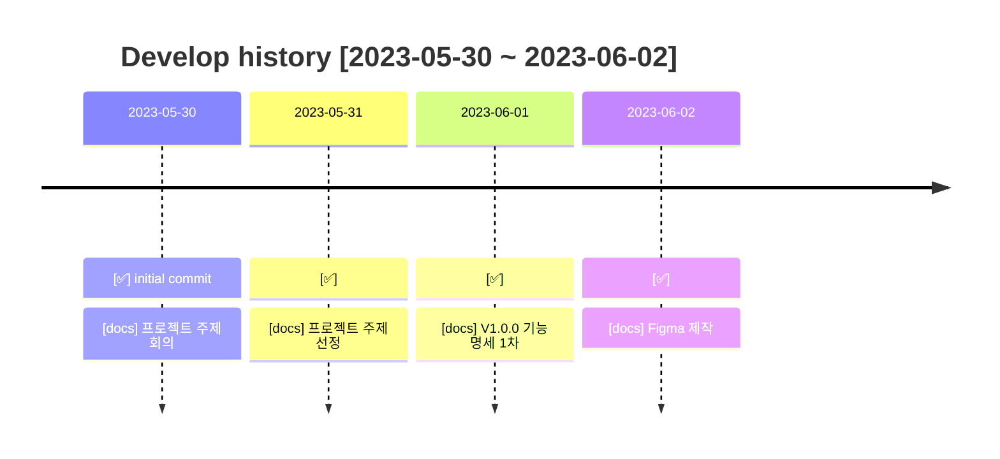
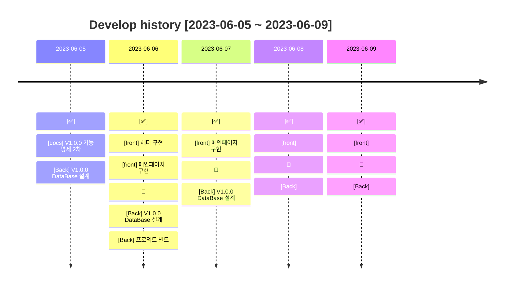
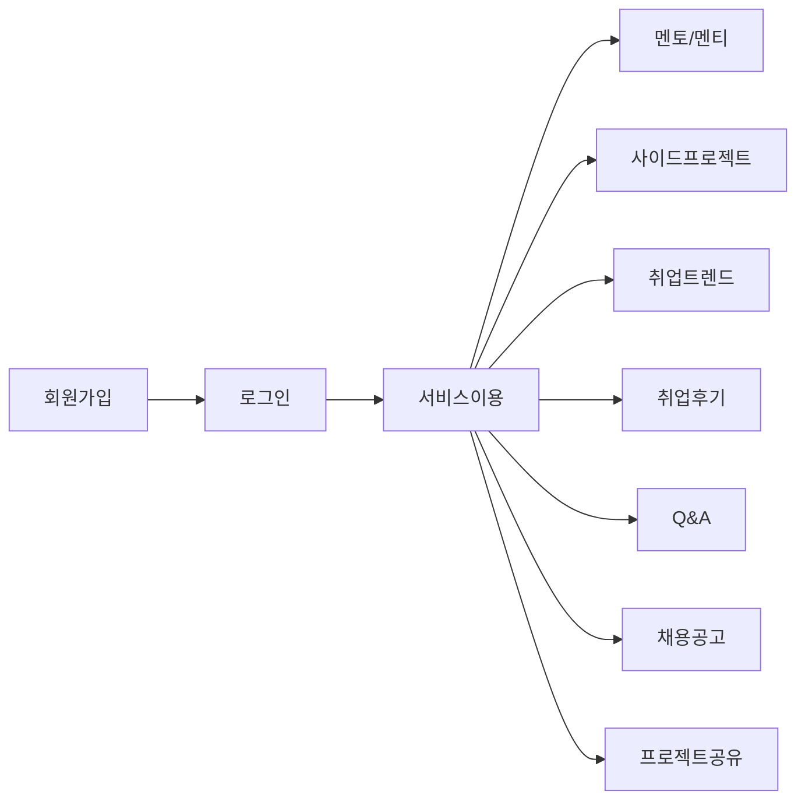

# ;; CLUB

### 개요

---

### 팀원

---

| 이름        | 담당              | GITHUB                                  |
|-----------|-----------------|-----------------------------------------|
| 👨‍💻 김태근 | FRONT, BACK     | https://github.com/taegeun1111          |
| 👨‍💻 조경훈 | FRONT, BACK     | https://github.com/oslob99              |
| 👩‍💻 조예원 | PM, FRONT, BACK | https://github.com/JOY0987              |
| 👩‍💻 채지원 | FRONT, BACK     | https://github.com/Hazel0c0             |
| 👩‍💻 최예진 | FRONT, BACK     | https://github.com/Yajani               |

### 기술 스택

---

### 주요 기능

---

### 개발 이력

---

### 버전 정보

---

#### ✅ v1.0.0

---

- #### V1.0 개발 전략
    - [v1.0.0] 회원가입을 성공시킨다

### DataBase

---

### Git Flow

---

- #### main : 우리의 서비스가 출시되는 브랜치

> 1. 태그를 달아서 버전을 알려줍니다.
> 2. develop 브랜치만 merge 합니다.  
     $git merge develop  
     $git tag "v1.0.0"

- #### develop : 다음 출시 버전을 개발하는 브랜치

> 1. feat 브랜치들에서 개발한 병합합니다.
> 2. 커밋 이력을 남기기 위해 '--no-ff' 옵션을 부여합니다.  
     $git merge --no-ff feat/[name]/

- #### feat/[name]/front : Front 기능을 개발하는 브랜치
- #### feat/[name]/back : Back 기능을 개발하는 브랜치

> ex. feat/jyw/login : 로그인 기능을 개발하는 브랜치

- #### release : 이번 출시 버전을 준비하는 브랜치

- #### hotfix : 출시 버전에서 발생한 버그를 수정하는 브랜치
