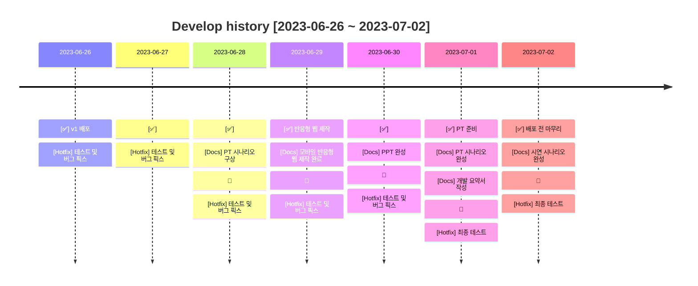
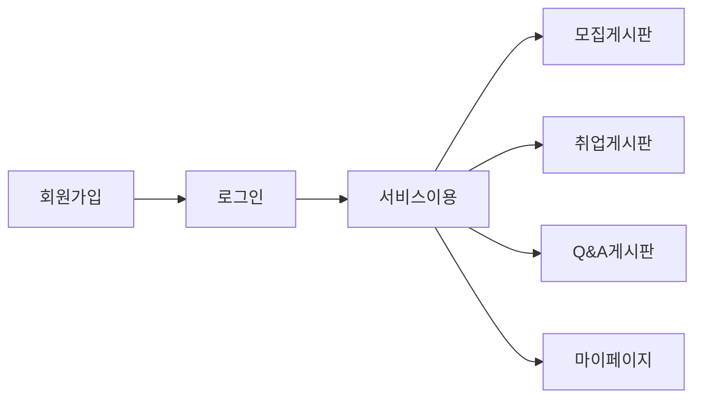
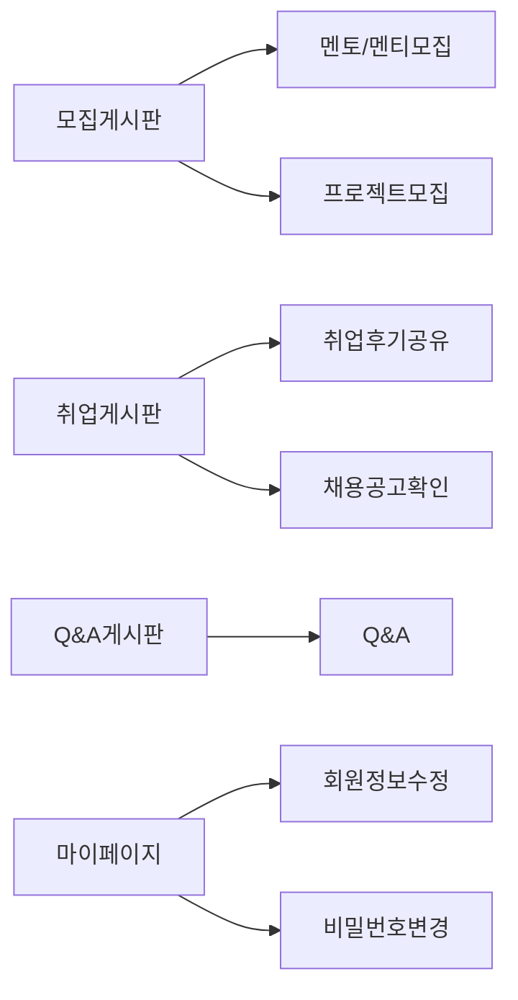

# ;; CLUB

### LINK 👉  ddamddamclub.shop 
데스크탑, 모바일 접속 가능 🙌

  

### 목차

1. [서비스 개요](#📢-서비스-개요)
2. [팀원 소개](#👋-팀원)
3. [기술 스택](#🔨-기술-스택)
4. [주요 기능 및 로직 소개](#🎯-주요-기능-및-로직-소개)
5. [개발 이력](#📜-개발-이력)
6. [버전 정보](#💡-버전-정보)
7. [DataBase](#⚙-DataBase)
8. [Git Flow](#🐱‍🏍-Git-Flow)

  

### 📢 서비스 개요

---

#### 기존의 개발자 커뮤니티,

#### 고인물 사이에서 이용하기 껄끄러웠던 적이 있지 않으셨나요? 😥

 

;;CLUB은 초급 개발자들을 중심으로 한 개발자 커뮤니티 공간을 제공합니다.

초급 개발자들이 소외되지 않고 필요한 서비스를 간편하게 이용하는 것을 서비스의 목표로 삼아 제작했습니다.

회원 간 자유로운 소통을 기반으로, 개발 공부를 함께 하고 취업에 대한 이야기를 나눌 수 있습니다.

### ;;CLUB의 회원이 되어 같이 소통해보실래요? 😉

  

### 👋 팀원

---

| 이름        | 담당                      | GITHUB                         |
|-----------|-------------------------|--------------------------------|
| 👩‍💻 조예원 | PM, FRONT, <b>✨BACK</b> | https://github.com/JOY0987     |
| 👨‍💻 김태근 | <b>✨FRONT</b>, BACK     | https://github.com/taegeun1111 |
| 👨‍💻 조경훈 | FRONT, <b>✨BACK</b>     | https://github.com/oslob99     |
| 👩‍💻 채지원 | FRONT, <b>✨BACK</b>     | https://github.com/Hazel0c0    |
| 👩‍💻 최예진 | FRONT, <b>✨BACK</b>     | https://github.com/Yajani      |

  

### 🔨 기술 스택
#### 📜 FRONT

  
  
  
  
  

#### 🛠️ BACK

  
  
  
  

#### 📀 DB

  

#### ✂️ Tool

  
  

#### ⭐️ etc

  
  
  
  

 

---

  

### 🎯 주요 기능 및 로직 소개

---

### 📄 회원가입 & 로그인
- 회원은 일반, 카카오 계정을 통해 회원가입 및 로그인이 가능합니다.
- 비밀번호를 잊은 회원은 [비밀번호 찾기] 를 통해 임시 비밀번호를 발급받을 수 있습니다.

### 📄 마이페이지
- 회원이 현재 참여 중인 멘토링, 프로젝트를 확인할 수 있습니다.
- 회원이 모든 게시판에 작성한 게시글을 확인할 수 있습니다.
- 회원 정보 수정이 가능합니다.
    1. 이름, 닉네임, 생년월일, 개발 포지션, 경력, 프로필사진을 수정할 수 있습니다.
- 비밀번호 변경이 가능합니다.
    1. 기존 비밀번호를 입력하여 검증 후, 새로운 비밀번호로 변경할 수 있습니다.

### 📄 멘토/멘티 모집
- 사용자가 게시글을 작성해 직접 멘토가 되어 멘티와 함께 성장하는 멘토링시스템, 1 대 1 실시간 채팅과 함께 하세요.
- 프론트엔드, 백엔드, 취업진로, 기타 순으로 중복 정렬해서 게시글을 볼 수 있습니다.
- 작성자만 상세페이지에서 수정, 삭제가 가능합니다.
- 작성자가 멘토가 되어 멘티의 채팅방 조회, 채팅메세지들을 볼 수 있습니다.
- 멘토가 멘티들을 확정해 멘티의 목록을 확인할 수 있습니다.
- 멘티는 멘토에게 신청하기를 눌러 1 대 1 실시간 채팅을 할 수 있습니다.

### 📄 프로젝트 모집
- 키워드(제목, 내용)를 통해 게시글을 조회 할 수 있습니다
    - 게시글은 인기순과 좋아요 순으로 화면에 표시됩니다
- 회원은 프로젝트 모집 게시글 작성이 가능합니다
    - 작성자만 삭제, 수정이 가능합니다
- 게시글에 좋아요를 할 수 있습니다
    - 한 회원당 게시글에 한번의 좋아요만 누를 수 있습니다
- 회원은 게시글을 클릭하면 상세보기 확인할 수 있으며, 모집글에 신청을 할 수 있습니다
    - 본인의 게시글에는 신청을 할 수 없습니다
- 회원은 [ 남은 자리, 참가 인원, 마감일자 , 인기순] 의 조건을 통해 빠르게 시작할 수 있는 프로젝트를 매칭 받을 수 있습니다

### 📄 Q&A
- 회원은 질문 게시글 작성이 가능합니다.
  - 게시글과 관련된 해시태그를 10개까지 작성할 수 있습니다.
- 회원은 답변 댓글 작성이 가능합니다.
- 게시글 작성자는 답변 댓글을 채택할 수 있습니다.
  - 댓글이 채택되면, 게시글은 채택완료 상태로 변경됩니다.
  - 채택완료 후 다른 댓글은 채택할 수 없습니다.
- 회원은 게시글 수정, 삭제가 가능합니다.
  - 채택완료 후에는 게시글 수정, 삭제가 불가능합니다.
- 회원은 댓글 수정, 삭제가 가능합니다.
  - 게시글이 채택완료된 후에는 댓글 수정, 삭제가 불가능합니다.
- 회원은 게시글 검색이 가능합니다.
  - 게시글의 제목, 내용, 해시태그로 검색이 가능합니다.
- 회원은 주간 인기글을 조회할 수 있습니다.
  - 월요일 0시부터 일요일 11시 59분까지의 주간 조회수를 기준으로 갱신되는 인기글을 조회할 수 있습니다.

### 📄 취업후기
- 여러가지 회사에 대한 회원들의 생생한 후기를 볼 수 있습니다.
- 회사에 대한 평점, 위치와 같은 기본적인 정보를 포함해서 후기를 작성합니다.
- 글을 쓴 작성자만이 상세페이지에서 수정, 삭제가 가능합니다.
- 취업후기의 상세보기를 클릭할 때마다 조회수가 상승합니다.
- 조회수순, 평점순, 최신순으로 정렬해서 글을 볼 수 있습니다.
- 검색창으로 키워드 검색이 가능합니다.

### 📄 채용공고 확인

- 24시간을 간격으로 업데이트되는 API 정보로 개발자 채용공고를 볼 수 있습니다.
- 백엔드와 프론트엔드 별로 채용공고를 나눠서 조회할 수 있습니다.
- 경력별로 공고 나눠서 조회가 가능합니다.
- 키워드 검색시 포지션과 경력을 선택후에 중복으로 조회가 가능합니다.

  

### 📜 개발 이력

---

### 🕘 개발 기간 (약 한 달 소요)
2023-05-30 ~ 20234-07-01

 

  

### 💡 버전 정보

---

#### ✅ v1.0.0

---

        

  

### ⚙ DataBase

---
### 14 TABLES

  

### 🐱‍🏍 Git Flow

---

- #### main : 우리의 서비스가 출시되는 브랜치

> 1. 태그를 달아서 버전을 알려줍니다.
> 2. develop 브랜치만 merge 합니다.  
     $git merge develop  
     $git tag "v1.0.0"

- #### develop : 다음 출시 버전을 개발하는 브랜치

> 1. feat 브랜치들에서 개발한 병합합니다.
> 2. 커밋 이력을 남기기 위해 '--no-ff' 옵션을 부여합니다.  
     $git merge --no-ff feat/[name]/

- #### feat/[name]/front : Front 기능을 개발하는 브랜치
- #### feat/[name]/back : Back 기능을 개발하는 브랜치

> ex. feat/jyw/login : 로그인 기능을 개발하는 브랜치

- #### release : 이번 출시 버전을 준비하는 브랜치

- #### hotfix : 출시 버전에서 발생한 버그를 수정하는 브랜치 
