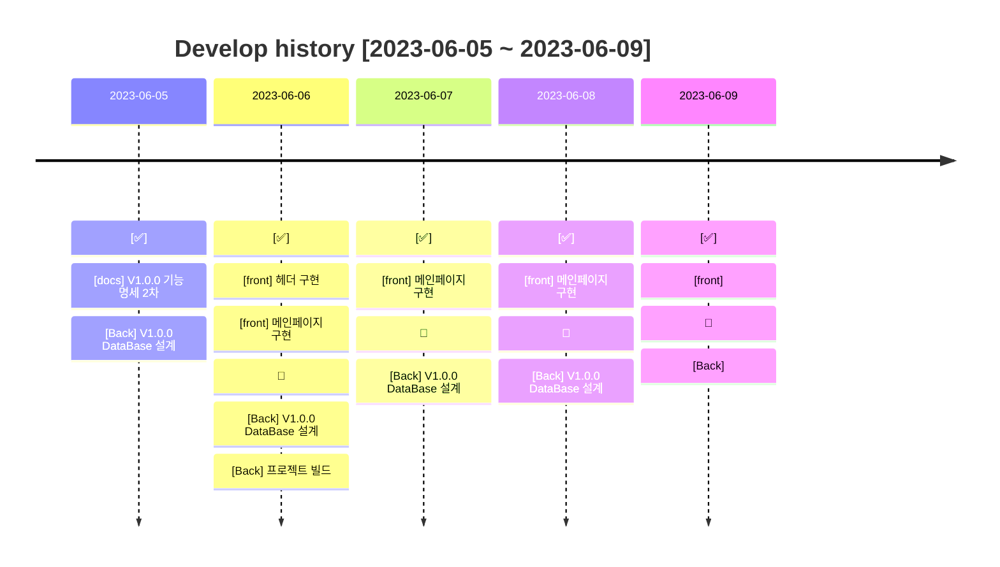

# ;; CLUB

 

### 📢 서비스 개요

---

#### 기존의 개발자 커뮤니티,

#### 고인물 사이에서 이용하기 껄끄러웠던 적이 있지 않으셨나요? 😥

 

;;CLUB은 초급 개발자들을 중심으로 한 개발자 커뮤니티 공간을 제공합니다.

초급 개발자들이 소외되지 않고 필요한 서비스를 간편하게 이용하는 것을 서비스의 목표로 삼아 제작했습니다.

회원 간 자유로운 소통을 기반으로, 개발 공부를 함께 하고 취업에 대한 이야기를 나눌 수 있습니다.

### ;;CLUB의 회원이 되어 같이 소통해보실래요? 😉

  

### 팀원

---

| 이름        | 담당                      | GITHUB                         |
|-----------|-------------------------|--------------------------------|
| 👨‍💻 김태근 | <b>✨FRONT</b>, BACK     | https://github.com/taegeun1111 |
| 👨‍💻 조경훈 | FRONT, <b>✨BACK</b>     | https://github.com/oslob99     |
| 👩‍💻 조예원 | PM, FRONT, <b>✨BACK</b> | https://github.com/JOY0987     |
| 👩‍💻 채지원 | FRONT, <b>✨BACK</b>     | https://github.com/Hazel0c0    |
| 👩‍💻 최예진 | FRONT, <b>✨BACK</b>     | https://github.com/Yajani      |

  

### 🔨 기술 스택

---
#### ⚡ FRONT
이모지 넣자ㅏㅏㅏㅏㅏㅏㅏㅏ
#### ⚡ BACK
이모지 넣작

  

### 🎯 주요 기능

---

각 게시판 별 기능, 중요 로직 있으면 넣기!

  

### 📜 개발 이력

---

  

### 💡 버전 정보

---

#### ✅ v1.0.0

---

- #### V1.0 개발 전략
    - 회원가입을 성공시킨다
    - 로그인을 성공시킨다
    - 멘토/멘티 게시판 구현
    - 프로젝트모집 게시판 구현
    - Q&A 게시판 구현
    - 취업후기 게시판 구현

  

### ⚙ DataBase

---

데이터베이스 모두 완성후에 추가 예정 ~~~

  

### 🐱‍🏍 Git Flow

---

- #### main : 우리의 서비스가 출시되는 브랜치

> 1. 태그를 달아서 버전을 알려줍니다.
> 2. develop 브랜치만 merge 합니다.  
     $git merge develop  
     $git tag "v1.0.0"

- #### develop : 다음 출시 버전을 개발하는 브랜치

> 1. feat 브랜치들에서 개발한 병합합니다.
> 2. 커밋 이력을 남기기 위해 '--no-ff' 옵션을 부여합니다.  
     $git merge --no-ff feat/[name]/

- #### feat/[name]/front : Front 기능을 개발하는 브랜치
- #### feat/[name]/back : Back 기능을 개발하는 브랜치

> ex. feat/jyw/login : 로그인 기능을 개발하는 브랜치

- #### release : 이번 출시 버전을 준비하는 브랜치

- #### hotfix : 출시 버전에서 발생한 버그를 수정하는 브랜치
